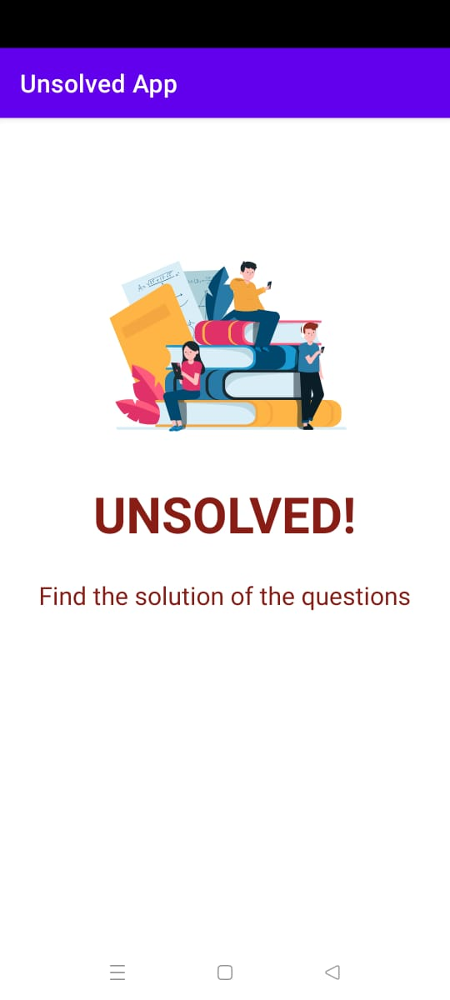
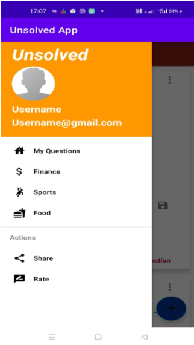
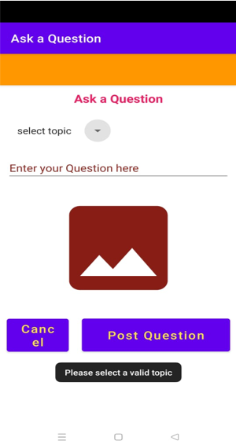

# UNSOLVED Mobile App

## About

###### UNSOLVED is a social Q&A app where users can ask queries and get it solved by other  users.

## App Screenshots

**Splash screen**

**Drawer screen**

**Home screen**

**Posting question**

## Future improvements

The Project can be further developed for future improvements with the following features .The App can be enhanced to further features such as chat , Voice/Video call etc .
The UI/UX can improved more so that it’ll attract more users.
User data protection can be improved more.

